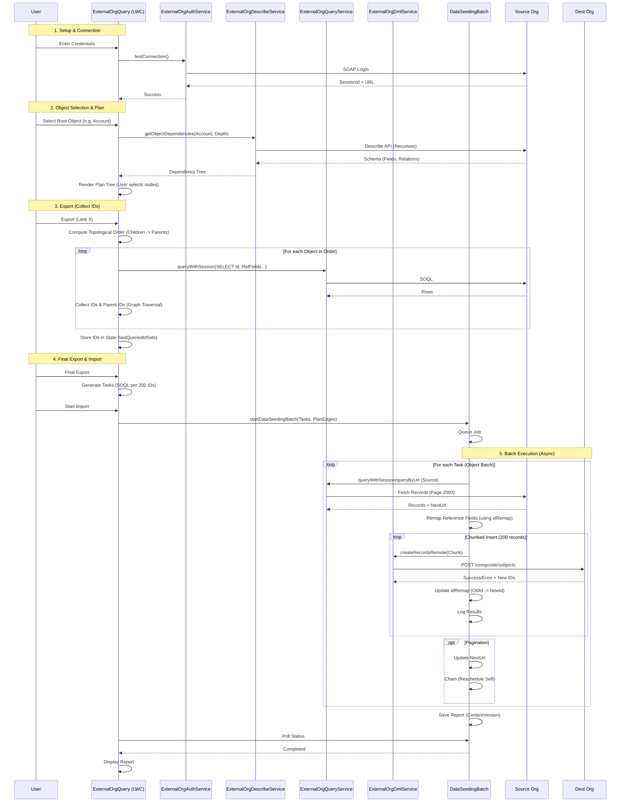

# Data Seeding Algorithm & Execution Flow

## detailed Code Flow

### 1. Initialization

- **LWC**: `externalOrgQuery` initializes.
- **Auth**: User provides credentials. `ExternalOrgAuthService.login` performs SOAP login to get `sessionId` and `serverUrl`.
- **Discovery**: `ExternalOrgDescribeService.getAvailableObjects` fetches SObjects.

### 2. Plan Generation

- **Selection**: User selects an object.
- **Describe**: `ExternalOrgDescribeService.getObjectDependencies` recursively builds a tree.
  - Uses `describeCache` to minimize callouts.
  - Handles `maxDepth` and `excludedObjects`.
  - Identifies `reference` fields (Lookups) and `childRelationships`.
- **UI**: Tree is rendered. User unchecks/checks nodes.
- **Topological Sort**: `computeExportOrder` in JS sorts objects so parents are processed before children.

### 3. ID Collection (Bootstrap)

- **Goal**: Find relevant records to seed starting from the root object.
- **Process**:
  1. Query Root Object (Limit X).
  2. Extract IDs and Reference IDs (Parent IDs).
  3. Recursively Query Parents based on extracted IDs.
  4. Store all collected IDs in `lastQueriedIdSets`.

### 4. Batch Preparation

- **Final Export**: LWC generates a list of "Tasks".
  - Each Task = Object Name + SOQL query for specific IDs (WHERE Id IN (...)).
  - Queries are chunked (e.g. 200 IDs per query) to keep SOQL length manageable.
- **Start**: `DataSeedingService.startDataSeedingBatch` is called.
  - Pass `taskList`: Ordered list of queries (Parents First).
  - Pass `planEdges`: Map of Reference Fields for ID remapping.

### 5. Batch Execution (`DataSeedingBatch`)

- **State**: Maintains `idRemap` (Map<Object, Map<OldId, NewId>>).
- **Execute**:
  1. **Fetch**: `ExternalOrgQueryService` executes the task's SOQL against Source.
     - Handles standard pagination (nextRecordsUrl).
  2. **Remap**: Iterates fetched records.
     - For each field in `planEdges`, checks if value exists in `idRemap`.
     - Replaces Source ID with Destination ID.
  3. **Insert**: `ExternalOrgDmlService` sends records to Destination.
     - **CRITICAL**: Must chunk into 200 records for Composite API.
  4. **Update Map**: On success, store `OldId -> NewId` in `idRemap`.
  5. **Log**: Store success/error in `logs` list.
- **Chaining**:
  - If `nextRecordsUrl` exists -> Chain same task.
  - Else -> Move to next task -> Chain.
- **Finish**: Save `logs` as JSON in `ContentVersion`.
